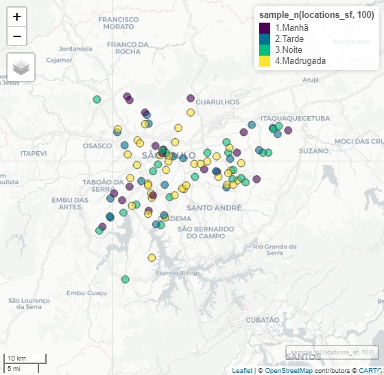

# Resultados {#resultados}

No Capítulo \@ref(metodologia), foram apresentados todos os detalhes dos dados e da metodologia utilizada na análise dos boletins de ocorrência. Neste capítulo, além de uma breve análise descritiva da base completa, serão apresentados os algoritmos utilizados e seus respectivos resultados, com destaque para a acurácia como principal métrica. Trazemos também a proporção de cada classe na estimação do modelo e gráficos AUC-ROC, para verificar se o acerto do modelo pode estar concentrado em alguma categoria (por exemplo, não queremos um modelo que sempre forneça uma determinada classe de horário como previsão).


```{r include=FALSE}
library(ggplot2);library(plyr);library(dplyr);library(lubridate);library(stringr);library(tidyverse);library(sf);library(mapview)
library(tidymodels);library(themis);library(parsnip);library(workflows);library(randomForest); library(glmnet); library(class)
```

## Análise descritiva {#descritiva}

```{r include = FALSE}
df <- read.csv('RDO_3.csv')
skim <- df %>% dplyr::mutate_all(~dplyr::na_if(., "NULL")) %>% skimr::skim()

df$DATA_OCORRENCIA_BO <- as.Date(df$DATA_OCORRENCIA_BO,format="%d/%m/%Y")
df$HORA_OCORRENCIA_BO <- lubridate::hour(strptime(x = df$HORA_OCORRENCIA_BO, format = "%H:%M"))
df$IDADE_PESSOA <- as.numeric(df$IDADE_PESSOA)
df <- df[!(is.na(df$HORA_OCORRENCIA_BO) | df$HORA_OCORRENCIA_BO==""), ]
df <- df[(is.na(df$X) | df$X==""), ]
df$target <- cut(df$HORA_OCORRENCIA_BO, 
                 breaks = c(-0.5, 5.5, 11.5, 17.5, 23.5), 
                 labels = c('4.Madrugada', '1.Manhã', '2.Tarde', '3.Noite'))
df$LATITUDE <- as.numeric(df$LATITUDE)
df$LONGITUDE <- as.numeric(df$LONGITUDE)

da <- df %>% janitor::clean_names() %>% dplyr::select(-x) %>% tibble::as_tibble()
```

### Tipo de local da ocorrência

O tipo de local mais comum dos crimes são vias públicas, que representa quase 60% de todos os boletins registrados na base.

```{r echo = FALSE, fig.width=10, fig.height=6}
da %>% 
  dplyr::count(descr_tipolocal, sort = TRUE) %>% 
  dplyr::mutate(prop = n/sum(n)) %>% 
  head(10) %>% 
  dplyr::mutate(descr_tipolocal = forcats::fct_reorder(descr_tipolocal, n)) %>% 
  ggplot2::ggplot(ggplot2::aes(y = descr_tipolocal, x = prop)) +
  ggplot2::geom_col() +
  ggplot2::scale_x_continuous(labels = scales::label_percent(accuracy = 1)) +
  ggplot2::labs(y = "", x = "", title = "Principais tipos de local das ocorrências") +
  ggplot2::theme_minimal(14)
```

### Localização

A seguir vemos como as ocorrências se distribuem geograficamente por São Paulo, com grande concentração na região central da cidade.

```{r warning = FALSE, message = FALSE, echo = FALSE, fig.width=10, fig.height=8}
sh_sp <- geobr::read_municipality(code_muni = 3550308)

da_mapa <- da %>% 
  dplyr::filter(!is.na(longitude), !is.na(latitude),
                dplyr::between(latitude, -25, -23), 
                dplyr::between(longitude, -48, -46))
ggplot2::ggplot() +
  ggplot2::geom_sf(data = sh_sp) +
  ggplot2::geom_point(
    data = da_mapa, 
    ggplot2::aes(x = longitude, y = latitude),
    alpha = .1, size = .0001) +
  ggplot2::theme_void()
```

Considerando nossa amostra utilizada na modelagem, e vendo as categorias de período, chegamos ao seguinte mapa:



### Sexo e idade das vítimas

```{r echo = FALSE, message = FALSE, warning = FALSE, fig.height = 3, fig.width = 10}
da %>% 
  dplyr::mutate(descr_tipo_pessoa = stringr::str_squish(descr_tipo_pessoa)) %>% 
  dplyr::filter(descr_tipo_pessoa == "Vítima") %>% 
  dplyr::count(sexo_pessoa) %>% 
  dplyr::mutate(prop = n/sum(n), pct = "pct") %>% 
  ggplot2::ggplot(ggplot2::aes(y = pct, x = prop, fill = sexo_pessoa)) +
  ggplot2::geom_col() +
  ggplot2::geom_text(
    ggplot2::aes(label = scales::percent(prop)),
    position = ggplot2::position_stack(vjust = .5),
    colour = "white", size = 6
  ) +
  ggplot2::scale_x_continuous(labels = scales::label_percent(accuracy = 1)) +
  ggplot2::labs(y = "", x = "", title = "Sexo das vítimas", fill = "") +
  ggplot2::scale_fill_viridis_d(begin = 0.2, end = 0.6) +
  ggplot2::theme_void(14) +
  ggplot2::theme(axis.text.y = ggplot2::element_blank(),
                 legend.position = "bottom")
da_idade <- da %>% 
  dplyr::mutate(idade_pessoa = as.numeric(idade_pessoa)) %>%  
  dplyr::mutate(descr_tipo_pessoa = stringr::str_squish(descr_tipo_pessoa)) %>% 
  dplyr::filter(descr_tipo_pessoa == "Vítima", 
                dplyr::between(idade_pessoa, 0, 100))
da_idade %>% 
  ggplot2::ggplot(ggplot2::aes(x = idade_pessoa)) +
  ggplot2::geom_histogram(ggplot2::aes(y = ..density..)) +
  ggplot2::geom_vline(xintercept = mean(da_idade$idade_pessoa)) +
  ggplot2::geom_vline(xintercept = median(da_idade$idade_pessoa), colour = "red") +
  ggplot2::theme_minimal(14) +
  ggplot2::labs(title = "Idade das vítimas")
```


### Tipificação

```{r echo = FALSE, fig.width = 10}
da %>%
  dplyr::mutate(
    rubrica_agrupada = dplyr::case_when(
      stringr::str_detect(rubrica, "Estupro") ~ "Estupro",
      stringr::str_detect(rubrica, "Furto") ~ "Furto",
      stringr::str_detect(rubrica, "Roubo") ~ "Roubo",
      stringr::str_detect(rubrica, "Homicídio") ~ "Homicídio",
      stringr::str_detect(rubrica, "Lesão") ~ "Lesão corporal"
    )
  ) %>%
  dplyr::count(rubrica_agrupada, rubrica) %>%
  ggplot2::ggplot(ggplot2::aes(
    area = n,
    fill = rubrica_agrupada,
    subgroup = rubrica_agrupada,
    label = scales::number(n, scale = .001, suffix = "k", accuracy = 1)
  )) +
  treemapify::geom_treemap() +
  treemapify::geom_treemap_subgroup_border() +
  treemapify::geom_treemap_text(colour = "white",
                                place = "centre",
                                grow = FALSE) +
  ggplot2::scale_fill_viridis_d() +
  ggplot2::labs(fill = "Rubrica agrupada") +
  ggplot2::theme(legend.text = ggplot2::element_text(size = 14))
  
```


### Distribuição da idade por cor

```{r echo = FALSE, message = FALSE, warning = FALSE, fig.width = 10}
da %>%
  dplyr::mutate(
    idade_pessoa = as.numeric(idade_pessoa),
    cor_cutis = dplyr::na_if(cor_cutis, "NULL")
  ) %>% 
  dplyr::mutate(descr_tipo_pessoa = stringr::str_squish(descr_tipo_pessoa)) %>% 
  dplyr::filter(descr_tipo_pessoa == "Vítima", 
                dplyr::between(idade_pessoa, 0, 100)) %>% 
  dplyr::select(idade_pessoa, cor_cutis) %>% 
  dplyr::filter(!is.na(cor_cutis)) %>% 
  ggplot2::ggplot(ggplot2::aes(x = idade_pessoa, y = cor_cutis, fill = cor_cutis)) +
  ggridges::geom_density_ridges() +
  ggplot2::theme_minimal(14) +
  ggplot2::scale_fill_viridis_d(begin = 0.2, direction = -1) +
  ggplot2::labs(x = "Idade da vítima", y = "") +
  ggplot2::theme(legend.position = "none")
```

### Vítimas fatais

```{r echo = FALSE, fig.width = 10}
da %>%
  dplyr::mutate(descr_tipo_pessoa = stringr::str_squish(descr_tipo_pessoa)) %>% 
  dplyr::filter(flag_vitima_fatal %in% c("S", "N"),
                descr_tipo_pessoa == "Vítima") %>%
  dplyr::count(flag_vitima_fatal, cor_cutis) %>%
  dplyr::group_by(cor_cutis) %>%
  dplyr::mutate(prop = n/sum(n), pct = scales::percent(prop)) %>% 
  ggplot2::ggplot(ggplot2::aes(x = cor_cutis, y = prop, fill = flag_vitima_fatal)) +
  ggplot2::geom_col() +
  ggplot2::scale_fill_viridis_d(begin = 0.1, end = 0.8) +
  ggplot2::scale_y_continuous(labels = scales::percent) +
  ggplot2::labs(x = "Cor", y = "", fill = "Vítima fatal") +
  ggplot2::theme_minimal()
```


### Horário e dia da semana

```{r echo = FALSE, fig.width = 10, warning = FALSE}
da %>% tibble::as_tibble() %>% 
  dplyr::filter(hora_ocorrencia_bo != "NULL") %>% 
  dplyr::mutate(
    hora_cat = dplyr::case_when(
      hora_ocorrencia_bo < 6 ~ "madrugada",
      hora_ocorrencia_bo < 12 ~ "manhã",
      hora_ocorrencia_bo < 18 ~ "tarde",
      hora_ocorrencia_bo < 24 ~ "noite"
    )
  ) %>%
  dplyr::filter(!is.na(hora_cat)) %>% 
  dplyr::count(hora_cat) %>% 
  dplyr::mutate(hora_cat = forcats::fct_reorder(hora_cat, c(1,2,4,3)),
                prop = n/sum(n)) %>% 
  ggplot2::ggplot(ggplot2::aes(x = hora_cat, y = prop)) +
  ggplot2::geom_col(fill = viridis::viridis(1, begin = 0.2)) +
  ggplot2::geom_text(ggplot2::aes(label = scales::percent(prop, accuracy = .1)),
                     vjust = -1) +
  ggplot2::scale_y_continuous(labels = scales::percent) +
  ggplot2::theme_minimal(16) +
  ggplot2::labs(x = "", y = "")
```


## Random Forest
Avaliando os métodos, e começando com a Random Forest, vemos que a acurácia está em torno de 36%, tanto na base de desenvolvimento quanto de teste. O parâmetro de mínimo de observações por folha definido em 20 contribui para que não haja overfitting no ajuste do modelo. Além da acurácia, as curvas ROC indicam que o acerto não é tão diferente entre as classes, e as proporções da saída do modelo estão em equilíbrio.

```{r item Rforest}
crime_rf <- rand_forest(trees = 100, min_n = 20) %>%  set_mode("classification") %>%  set_engine("randomForest") %>%  fit(target ~ ., data = crime_training)
crime_rf %>%  predict(crime_training) %>%  bind_cols(crime_training) %>% metrics(truth = target, estimate = .pred_class)
crime_rf %>%  predict(crime_testing) %>%  bind_cols(crime_testing) %>% metrics(truth = target, estimate = .pred_class)
crime_probs_rf <- crime_rf %>% predict(crime_testing, type = "prob") %>% bind_cols(crime_testing)
crime_probs_rf %>%  roc_curve(target, .pred_4.Madrugada:.pred_3.Noite) %>%  autoplot()

crime_class_predict_rf <- crime_rf %>%  predict(crime_testing, type = "class") %>%  bind_cols(crime_testing)
crime_class_predict_rf$.pred_class %>% table %>% prop.table
```

A imagem abaixo traz uma representação gráfica da proporção de acertos e erros em uma amostra selecionada, levando em conta a distribuição espacial dos dados.


## Regressão Logística Multinomial
Partindo para a regressão logística multinomial, obtemos resultados piores em termos de acerto, verificando-se uma queda de aproximadamente 4%. As demais conclusões são semelhantes às obtidas através da Random Forest - assim, concluímos que a Random Forest performou melhor na comparação.

```{r item Regressao} 
penalty = 0
crime_reg <- multinom_reg(penalty = penalty) %>% set_engine("glmnet") %>% set_mode("classification") %>% fit(target ~ ., data = crime_training)
crime_reg %>%  predict(crime_training, penalty = penalty) %>%  bind_cols(crime_training) %>% metrics(truth = target, estimate = .pred_class)
crime_reg %>%  predict(crime_testing, penalty = penalty) %>%  bind_cols(crime_testing) %>% metrics(truth = target, estimate = .pred_class)
crime_probs_reg <- crime_reg %>% predict(crime_testing, penalty = penalty, type = 'prob') %>% bind_cols(crime_testing)
# colnames(crime_probs_reg) <- c('pred4', 'pred1', 'pred2', 'pred3', colnames(crime_probs_reg[5:26]))
crime_probs_reg %>% roc_curve(target, .pred_4.Madrugada:.pred_3.Noite) %>%  autoplot()
crime_class_predict_reg <- crime_reg %>%  predict(crime_testing, penalty = penalty, type = "class") %>%  bind_cols(crime_testing)
crime_class_predict_reg$.pred_class %>% table %>% prop.table
```

## Vizinhos mais próximos (KNN)
Considerando as características de geolocalização dos dados (em especial as variáveis de longitude e latitude), o uso da técnica de vizinhos mais próximos (KNN) pode fornecer interpretações e resultados interessantes. O ajuste aos dados realizado abaixo indica que o método traz um ganho considerável em relação aos até então descritos, com uma acurácia maior que 50%. 

O ajuste da mesma técnica foi feito, também, utilizando apenas as duas variáveis espaciais; o resultado obtido também é interessante, pois resultou em acertos próximos a 50% mesmo com a redução das variáveis consideradas. 

```{r item knn, eval=FALSE, echo=TRUE}
knn_train_predict <- class::knn(train=as.matrix(dplyr::select(crime_training, -c(target))),
                               test= as.matrix(dplyr::select(crime_training, -c(target))),
                               cl =  as.matrix(dplyr::select(crime_training,  c(target))),
                               k = 5)
knn_test_predict <- class::knn(train=as.matrix(dplyr::select(crime_training, -c(target))),
                              test= as.matrix(dplyr::select(crime_testing, -c(target))),
                              cl = as.matrix(dplyr::select(crime_training, c(target))),
                              k = 5)
crime_training$acerto <- (crime_training$target == knn_train_predict)
crime_training$acerto %>% table %>% prop.table
crime_testing$acerto <- (crime_testing$target == knn_test_predict)
crime_testing$acerto %>% table %>% prop.table
crime_testing <- crime_testing[, -23]
crime_training <- crime_training[, -23]
``` 

```{r echo=FALSE}
tibble::tribble(
       ~.,                ~n,
  "FALSE", 0.365853338236067,
   "TRUE", 0.634146661763933
  )
tibble::tribble(
       ~.,                ~n,
  "FALSE", 0.425733333333333,
   "TRUE", 0.574266666666667
  )
```


## XGBoost
Outro modelo de machine learning foi proposto para a modelagem do nosso problema. O XGBoost é um método baseado em árvores e  este modelo foi proposto em 2016 no paper "Xgboost: A Scalable Tree Boosting System". Para tunarmos os parâmetros do modelo, separamos a amostra de treino em duas, a fim de escolhermos o melhor conjunto de parâmetros para o nosso modelo. Mesmo assim, com os parâmetros escolhidos baseados em um grid não foi possível alcançar uma acurácia melhor do que a do KNN para a base out-of-sample.

```{r item XGBoost, eval=FALSE}
library(xgboost)

test.label =  as.integer(crime_testing[,3]$target)-1
data.teste = as.matrix(crime_testing[,-3])
xgb.train = xgb.DMatrix(data=as.matrix(crime_training[,-22]),label= as.integer(crime_training[,22]$target)-1)
xgb.test = xgb.DMatrix(data=as.matrix(crime_testing[,-3]),label= as.integer(crime_testing[,3]$target)-1)

num_class = 4
params = list(booster="gbtree", eta=0.05, max_depth=2,gamma=1,subsample=1,colsample_bytree=0.3333, objective="multi:softprob", eval_metric="mlogloss",num_class=num_class)
xgb.fit=xgb.train(params=params,  data=xgb.train,  nrounds=500,  nthreads=7,  early_stopping_rounds=10,  verbose=0,  watchlist=list(val1=xgb.train,val2=xgb.test))

xgb.pred =  as.data.frame(predict(xgb.fit,data.teste,reshape=T))
colnames(xgb.pred) = levels(crime_testing$target)
xgb.pred$prediction = apply(xgb.pred,1,function(x) colnames(xgb.pred)[which.max(x)])
xgb.pred$label = levels(crime_testing$target)[test.label+1]

result = sum(xgb.pred$prediction==xgb.pred$label)/nrow(xgb.pred)
print(paste("Final Accuracy =",sprintf("%1.2f%%", 100*result)))
```

```{r echo=FALSE}
print("Final Accuracy = 34.17%")
```

