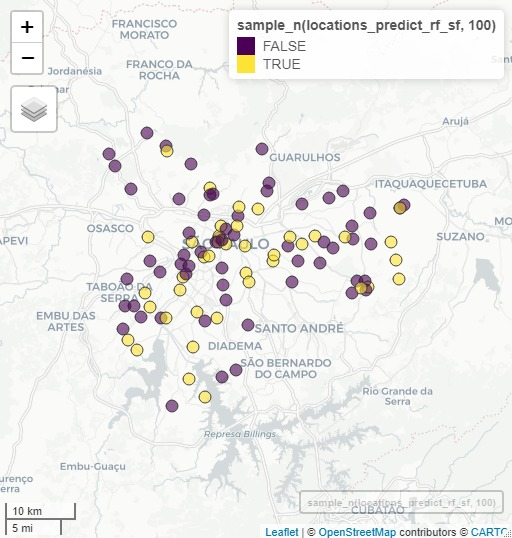
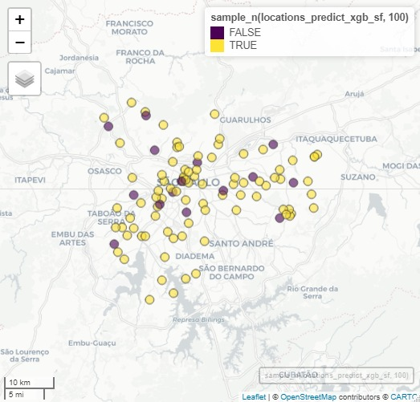
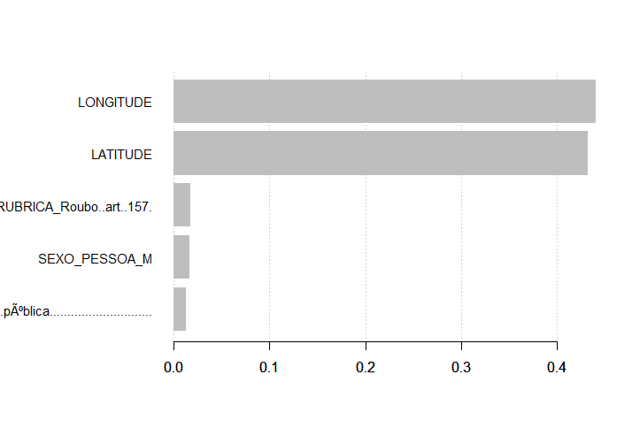

\pagebreak

# Descrição do Problema 

O Brasil tem a segunda maior taxa de homicídios da América do Sul, segundo relatório das Nações Unidas em 2017, e ocupa a 12ª posição no ranking global de violência, com uma taxa de 27,5% de homicídios a cada 100 000 habitantes. Em 2016, a Organização para a Cooperação e Desenvolvimento Econômico (OCDE) divulgou que as vítimas de assaltos no Brasil, nos últimos 12 meses da pesquisa, foram de 7,9% dos entrevistados, quase o dobro da média dos países em que a pesquisa foi realizada. Este preocupante quadro mostra a situação da violência e a necessidade de políticas públicas adequadas para segurança pública.


 A partir de dados de boletins de ocorrência (BO) da Secretaria de Seguraça Pública (SSP) do estado de São Paulo, o objetivo deste estudo é prever o horário do crime de acordo com algumas características, por exemplo, localização, sexo da vítima, cor da vítma, entre outros. Visando, dessa forma, identificar quais os horários das ocorrências de acordo com a tipologia do crime e assim fornecer insights para o policiamento. 

# Conjunto de dados

<!-- Endereço da competição ou da página onde o problema est á descrito --> 
A base dados que foi utilizada é a Crime Data in Brazil e pode ser acessada  [**aqui**](https://www.kaggle.com/inquisitivecrow/crime-data-in-brazil).

A base de dados que será trabalhada refere-se a boletins de ocorrência na Grande São Paulo.


```{r dados, echo=FALSE}
library(magrittr)
tibble::tribble(
                     ~variavel,                                                    ~descricao,
                "ID_DELEGACIA", "Código da delegacia responsável pelo registro da ocorrencia",
           "NOME_DEPARTAMENTO",                      "Departamento responsável pelo registro",
              "NOME_SECCIONAL",               "Delegacia Seccional responsável pelo registro",
              "NOME_DELEGACIA",                         "Delegacia responsável pelo registro",
                      "CIDADE",                                          "Cidade de Registro",
                      "ANO_BO",                                           "Ano da ocorrencia",
                      "NUM_BO",                                                "Número do BO",
      "NOME_DEPARTAMENTO_CIRC",                               "Departamento de Circunscrição",
         "NOME_SECCIONAL_CIRC",                                  "Seccional de Circunscrição",
         "NOME_DELEGACIA_CIRC",                                  "Delegacia de Circunscrição",
         "NOME_MUNICIPIO_CIRC",                                  "Município de Circunscrição",
               "DESCR_TIPO_BO",                                           "Tipo de Documento",
          "DATA_OCORRENCIA_BO",                                          "Data da Ocorrência",
          "HORA_OCORRENCIA_BO",                                          "Hora da Ocorrência",
     "DATAHORA_COMUNICACAO_BO",                      "Data Hora da Comunicação da Ocorrência",
                 "FLAG_STATUS",                                        "Status da Ocorrência",
                     "RUBRICA",                             "Natureza jurídica da ocorrência",
               "DESCR_CONDUTA",                                       "Conduta na Ocorrência",
               "DESDOBRAMENTO",                                 "Desdobramento na Ocorrência",
             "DESCR_TIPOLOCAL",                                               "Tipo de Local",
          "DESCR_SUBTIPOLOCAL",                               "Descrição do subTipo de local",
                  "LOGRADOURO",                                        "Logradouro dos fatos",
           "NUMERO_LOGRADOURO",                              "Numero do Logradouro dos fatos",
                    "LATITUDE",                                      "Latitude da Ocorrência",
                   "LONGITUDE",                                     "Longitude da Ocorrência",
           "DESCR_TIPO_PESSOA",                     "Qualificação do envolvido na ocorrência",
           "FLAG_VITIMA_FATAL",                      "Condição do Autor / Vítma na corrência",
                 "SEXO_PESSOA",                                                        "Sexo",
                "IDADE_PESSOA",                                                       "Idade",
                   "COR_CUTIS",                                                 "Cor da Pele"
     ) %>% 
  setNames(c("Variável", "Descrição")) %>% 
  knitr::kable()
```


## Possíveis variáveis de interesse

- Tipo de local da ocorrência
- Localização (latitude e longitude) da ocorrência
- Sexo da vítima
- Idade da vítima
- Tipificação do crime


```{r eval=require('magrittr'), echo=FALSE}
tibble::tribble(
                     ~variavel,                                                    ~descricao,
                "ID_DELEGACIA", "Código da delegacia responsável pelo registro da ocorrencia",
           "NOME_DEPARTAMENTO",                      "Departamento responsável pelo registro",
              "NOME_SECCIONAL",               "Delegacia Seccional responsável pelo registro",
              "NOME_DELEGACIA",                         "Delegacia responsável pelo registro",
                      "CIDADE",                                          "Cidade de Registro",
                      "ANO_BO",                                           "Ano da ocorrencia",
                      "NUM_BO",                                                "Número do BO",
      "NOME_DEPARTAMENTO_CIRC",                               "Departamento de Circunscrição",
         "NOME_SECCIONAL_CIRC",                                  "Seccional de Circunscrição",
         "NOME_DELEGACIA_CIRC",                                  "Delegacia de Circunscrição",
         "NOME_MUNICIPIO_CIRC",                                  "Município de Circunscrição",
               "DESCR_TIPO_BO",                                           "Tipo de Documento",
          "DATA_OCORRENCIA_BO",                                          "Data da Ocorrência",
          "HORA_OCORRENCIA_BO",                                          "Hora da Ocorrência",
     "DATAHORA_COMUNICACAO_BO",                      "Data Hora da Comunicação da Ocorrência",
                 "FLAG_STATUS",                                        "Status da Ocorrência",
                     "RUBRICA",                             "Natureza jurídica da ocorrência",
               "DESCR_CONDUTA",                                       "Conduta na Ocorrência",
               "DESDOBRAMENTO",                                 "Desdobramento na Ocorrência",
             "DESCR_TIPOLOCAL",                                               "Tipo de Local",
          "DESCR_SUBTIPOLOCAL",                               "Descrição do subTipo de local",
                  "LOGRADOURO",                                        "Logradouro dos fatos",
           "NUMERO_LOGRADOURO",                              "Numero do Logradouro dos fatos",
                    "LATITUDE",                                      "Latitude da Ocorrência",
                   "LONGITUDE",                                     "Longitude da Ocorrência",
           "DESCR_TIPO_PESSOA",                     "Qualificação do envolvido na ocorrência",
           "FLAG_VITIMA_FATAL",                      "Condição do Autor / Vítma na corrência",
                 "SEXO_PESSOA",                                                        "Sexo",
                "IDADE_PESSOA",                                                       "Idade",
                   "COR_CUTIS",                                                 "Cor da Pele"
     ) %>% 
  setNames(c("Variável", "Descrição")) %>% 
  DT::datatable()
```

# Avaliação do problema

A variável HORA_OCORRENCIA_BO será transformada de forma a produzir quatro classes de acordo com o horário do crime: manhã, tarde, noite e madrugada. O problema é de classificação.

Os  métodos de aprendizagem supervisionada para classificação utilizados serão:

- Multinomial logistic regression;
- Support Vector Machine Multiclass;
- K-Nearest Neighbor(KNN) Classification;
- Feedforward Neural Network For Multiclass Classification;
- Random Forest;
- Boosting;
- Bagging;
- Gradient Boosting.


# Análise Descritiva

```{r echo = FALSE}
# library(magrittr)
# da <- readr::read_rds("apresentacao/dados.rds") %>% 
#   janitor::clean_names()
# 
# skim <- da %>% dplyr::select(-v31) %>% dplyr::mutate_all(~dplyr::na_if(., "NULL")) %>% skimr::skim()
# 
# skim %>% dplyr::select(skim_variable, n_missing, complete_rate) %>% 
#   DT::datatable()
```

### Tipo de local da ocorrência

```{r echo = FALSE, fig.width=10, fig.height=6}
# 
# da %>% 
#   dplyr::count(descr_tipolocal, sort = TRUE) %>% 
#   dplyr::mutate(prop = n/sum(n)) %>% 
#   head(10) %>% 
#   dplyr::mutate(descr_tipolocal = forcats::fct_reorder(descr_tipolocal, n)) %>% 
#   ggplot2::ggplot(ggplot2::aes(y = descr_tipolocal, x = prop)) +
#   ggplot2::geom_col() +
#   ggplot2::scale_x_continuous(labels = scales::label_percent(accuracy = 1)) +
#   ggplot2::labs(y = "", x = "", title = "Principais tipos de local das ocorrências") +
#   ggplot2::theme_minimal(14)
```

### Localização

```{r warning = FALSE, echo = FALSE, fig.width=10, fig.height=8}
# sh_sp <- readr::read_rds("apresentacao/sh_sp.rds")
# da <- da %>% 
#   dplyr::mutate(
#     latitude = as.numeric(latitude),
#     longitude = as.numeric(longitude)
#   )
# 
# da_mapa <- da %>% 
#   dplyr::filter(!is.na(longitude), !is.na(latitude),
#                 dplyr::between(latitude, -25, -23), 
#                 dplyr::between(longitude, -48, -46))
# 
# ggplot2::ggplot() +
#   ggplot2::geom_sf(data = sh_sp) +
#   ggplot2::geom_point(
#     data = da_mapa, 
#     ggplot2::aes(x = longitude, y = latitude),
#     alpha = .1, size = .0001) +
#   ggplot2::theme_void()

```

### Sexo e idade das vítimas

```{r echo = FALSE, message = FALSE, warning = FALSE, fig.height = 3, fig.width = 10}
# da %>% 
#   dplyr::filter(descr_tipo_pessoa == "Vítima") %>% 
#   dplyr::count(sexo_pessoa) %>% 
#   dplyr::mutate(prop = n/sum(n), pct = "pct") %>% 
#   ggplot2::ggplot(ggplot2::aes(y = pct, x = prop, fill = sexo_pessoa)) +
#   ggplot2::geom_col() +
#   ggplot2::geom_text(
#     ggplot2::aes(label = scales::percent(prop)),
#     position = ggplot2::position_stack(vjust = .5),
#     colour = "white", size = 6
#   ) +
#   ggplot2::scale_x_continuous(labels = scales::label_percent(accuracy = 1)) +
#   ggplot2::labs(y = "", x = "", title = "Sexo das vítimas", fill = "") +
#   ggplot2::scale_fill_viridis_d(begin = 0.2, end = 0.6) +
#   ggplot2::theme_void(14) +
#   ggplot2::theme(axis.text.y = ggplot2::element_blank(),
#                  legend.position = "bottom")
# 
# da_idade <- da %>% 
#   dplyr::mutate(idade_pessoa = as.numeric(idade_pessoa)) %>%  
#   dplyr::filter(descr_tipo_pessoa == "Vítima", 
#                 dplyr::between(idade_pessoa, 0, 100))
# da_idade %>% 
#   ggplot2::ggplot(ggplot2::aes(x = idade_pessoa)) +
#   ggplot2::geom_histogram(ggplot2::aes(y = ..density..)) +
#   ggplot2::geom_vline(xintercept = mean(da_idade$idade_pessoa)) +
#   ggplot2::geom_vline(xintercept = median(da_idade$idade_pessoa), colour = "red") +
#   ggplot2::theme_minimal(14) +
#   ggplot2::labs(title = "Idade das vítimas")
```


### Tipificação

```{r echo = FALSE, fig.width = 10}
# da %>%
#   dplyr::mutate(
#     rubrica_agrupada = dplyr::case_when(
#       stringr::str_detect(rubrica, "Estupro") ~ "Estupro",
#       stringr::str_detect(rubrica, "Furto") ~ "Furto",
#       stringr::str_detect(rubrica, "Roubo") ~ "Roubo",
#       stringr::str_detect(rubrica, "Homicídio") ~ "Homicídio",
#       stringr::str_detect(rubrica, "Lesão") ~ "Lesão corporal"
#     )
#   ) %>%
#   dplyr::count(rubrica_agrupada, rubrica) %>%
#   ggplot2::ggplot(ggplot2::aes(
#     area = n,
#     fill = rubrica_agrupada,
#     subgroup = rubrica_agrupada,
#     label = scales::number(n, scale = .001, suffix = "k", accuracy = 1)
#   )) +
#   treemapify::geom_treemap() +
#   treemapify::geom_treemap_subgroup_border() +
#   treemapify::geom_treemap_text(colour = "white",
#                                 place = "centre",
#                                 grow = FALSE) +
#   ggplot2::scale_fill_viridis_d() +
#   ggplot2::labs(fill = "Rubrica agrupada") +
#   ggplot2::theme(legend.text = ggplot2::element_text(size = 14))
#   

```

### Distribuição da idade por cor

```{r echo = FALSE, message = FALSE, warning = FALSE, fig.width = 10}
# da %>%
#   dplyr::mutate(
#     idade_pessoa = as.numeric(idade_pessoa),
#     cor_cutis = dplyr::na_if(cor_cutis, "NULL")
#   ) %>% 
#   dplyr::filter(descr_tipo_pessoa == "Vítima", 
#                 dplyr::between(idade_pessoa, 0, 100)) %>% 
#   dplyr::select(idade_pessoa, cor_cutis) %>% 
#   dplyr::filter(!is.na(cor_cutis)) %>% 
#   ggplot2::ggplot(ggplot2::aes(x = idade_pessoa, y = cor_cutis, fill = cor_cutis)) +
#   ggridges::geom_density_ridges() +
#   ggplot2::theme_minimal(14) +
#   ggplot2::scale_fill_viridis_d(begin = 0.2, direction = -1) +
#   ggplot2::labs(x = "Idade da vítima", y = "") +
#   ggplot2::theme(legend.position = "none")
```

### Vítimas fatais

```{r echo = FALSE, fig.width = 10}
# da %>%
#   dplyr::filter(flag_vitima_fatal %in% c("S", "N"),
#                 descr_tipo_pessoa == "Vítima") %>%
#   dplyr::count(flag_vitima_fatal, cor_cutis) %>%
#   dplyr::group_by(cor_cutis) %>%
#   dplyr::mutate(prop = n/sum(n), pct = scales::percent(prop)) %>% 
#   ggplot2::ggplot(ggplot2::aes(x = cor_cutis, y = prop, fill = flag_vitima_fatal)) +
#   ggplot2::geom_col() +
#   ggplot2::scale_fill_viridis_d(begin = 0.1, end = 0.8) +
#   ggplot2::scale_y_continuous(labels = scales::percent) +
#   ggplot2::labs(x = "Cor", y = "", fill = "Vítima fatal") +
#   ggplot2::theme_minimal()
```


### Horário e dia da semana

```{r echo = FALSE, fig.width = 10, warning = FALSE}
# da %>% tibble::as_tibble() %>% 
#   dplyr::filter(hora_ocorrencia_bo != "NULL") %>% 
#   dplyr::mutate(
#     horario = lubridate::hm(hora_ocorrencia_bo) %>% lubridate::hour(),
#     hora_cat = dplyr::case_when(
#       horario < 6 ~ "madrugada",
#       horario < 12 ~ "manhã",
#       horario < 18 ~ "tarde",
#       horario < 24 ~ "noite"
#     )
#   ) %>%
#   dplyr::filter(!is.na(hora_cat)) %>% 
#   dplyr::count(hora_cat) %>% 
#   dplyr::mutate(hora_cat = forcats::fct_reorder(hora_cat, c(1,2,4,3)),
#                 prop = n/sum(n)) %>% 
#   ggplot2::ggplot(ggplot2::aes(x = hora_cat, y = prop)) +
#   ggplot2::geom_col(fill = viridis::viridis(1, begin = 0.2)) +
#   ggplot2::geom_text(ggplot2::aes(label = scales::percent(prop, accuracy = .1)),
#                      vjust = -1) +
#   ggplot2::scale_y_continuous(labels = scales::percent) +
#   ggplot2::theme_minimal(16) +
#   ggplot2::labs(x = "", y = "")

```


```{r warning = FALSE, message = FALSE, echo = FALSE, fig.width = 10}
# da %>% tibble::as_tibble() %>%
#   dplyr::filter(hora_ocorrencia_bo != "NULL") %>%
#   dplyr::mutate(
#     hora = paste0("2020-01-01 ", hora_ocorrencia_bo, ":00"),
#     hora = lubridate::as_datetime(hora),
#     dia_semana = lubridate::wday(lubridate::dmy(data_ocorrencia_bo))
#   ) %>%
#   ggplot2::ggplot(ggplot2::aes(y = dia_semana, x = hora)) +
#   ggbeeswarm::geom_quasirandom(alpha = .1, groupOnX = FALSE,
#                                fill = viridis::viridis(1, begin = .2)) +
#   ggplot2::scale_x_datetime(date_labels = "%H:%M", date_breaks = "1 hour") +
#   ggplot2::theme_minimal(16) +
#   ggplot2::labs(x = "", y = "dia da semana") 

```

# Métodos utilizados

- Regressão Logística Multinomial
- Árvore de decisão
- Random forest
- KNN - K-Nearest Neighbor Classification
- XGBoost


## Regressão Logística Multinomial


- É usada para prever a categoria ou a probabilidade de uma categoria em uma variável dependente com base em várias variáveis independentes.


- As variáveis independentes podem ser dicotômicas (ou seja, binárias) ou contínuas (ou seja, intervalo ou razão em escala).


- É uma extensão da regressão logística binária que permite mais de duas categorias da variável dependente.

## Random Forest


- É um método de aprendizagem de conjunto para classificação, regressão e outras tarefas.


- Constroi uma infinidade de árvores de decisão no momento do treinamento 


- Gera a categorias que é a moda das categorias, no caso de classificação.

--
- Corrigem o hábito das árvores de decisão de sobreajustar os dados de treinamento. 
.center[]


## KNN - K-Nearest Neighbor Classification


- Na classificação k-NN, a saída é uma associação de classe.


- Um objeto é classificado por uma pluralidade de votos de seus vizinhos, com o objeto sendo atribuído à classe mais comum entre seus k vizinhos mais próximos 


- Se k = 1, então o objeto é simplesmente atribuído à classe daquele único vizinho mais próximo.


- Valores maiores de k reduzem o efeito do ruído na classificação, mas tornam os limites entre as classes menos distintos.


.center[]


## XGBoost


- XGBoost é um algoritmo de aprendizado de máquina baseado em árvore de decisão que usa uma estrutura de gradiente _boosting_.


- Regularização: penaliza modelos mais complexos por meio da regularização LASSO (L1) e Ridge (L2) para evitar _overfitting_.


- Validação cruzada: O algoritmo vem com método de validação cruzada embutido em cada iteração, eliminando a necessidade de programar explicitamente essa pesquisa e especificar o número exato de iterações de reforço necessárias em uma única execução.

.center[]

# Resultados
  
```{r, echo=FALSE}

res <- tibble::tibble(
  Método = c(
    "Regressão Logística Multinomial",
    "Random Forest",
    "KNN",
    "XGBoost"
  ),
  'Acurácia Treino' = c(
    .322,0.362,0.609,0.845
  ),
  'Acurácia Teste' = c(
    .328,0.360,0.569,0.837
  ),
)

res %>% knitr::kable()
```

  
.center[]
  
.center[]

# Conclusão

- Variáveis espaciais, LAGITUDE e LONGITUDE, são as que mais apresentaram relevância nos modelos ajustados.

.center[]

- Variáveis espaciais, LAGITUDE e LONGITUDE, são as que mais apresentaram relevância nos modelos ajustados.

- Dos métodos ajustados, XGBoost foi o que apresentou a melhor acurácia após otimização de hiperparâmetros, seguido pelo KNN.


# Referências

BREIMAN, Leo. Bagging predictors. Machine learning, v. 24, n. 2, p. 123-140, 1996.

BREIMAN, Leo. Random forests. Machine learning, v. 45, n. 1, p. 5-32, 2001.

FRIEDMAN, Jerome H. Stochastic gradient boosting. Computational statistics & data analysis, v.  38, n. 4, p. 367-378, 2002.

HEARST, Marti A.. et al. Support vector machines. IEEE Intelligent Systems and their applications, v. 13, n. 4, p. 18-28, 1998

SVOZIL, Daniel; KVASNICKA, Vladimir; POSPICHAL, Jiri. Introduction to multi-layer feed-forward neural networks. Chemometrics and intelligent laboratory systems, v. 39, n. 1, p. 43-62, 1997.
